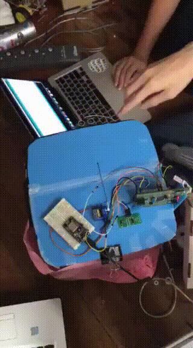

# Smart Trash project
## subject : embeded lab

## Pin 

### servo
ORANGE  - PD12 # PWM TIM4_CH1
RED     - 3V
BROWN   - GND

### nodeMCU
TX - PA3 RX
RX - PA2 TX

### inner ultra sonic
vdd     - 5V
trigger - PA4
echo    - PA5
gnd     - gnd

### outer ultra sonic
vdd     - 5V
trigger - PA6
echo    - PA7
gnd     - gnd
